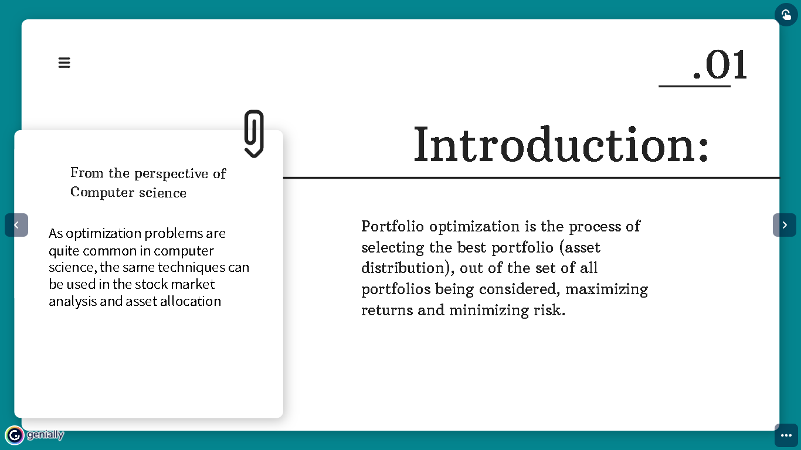
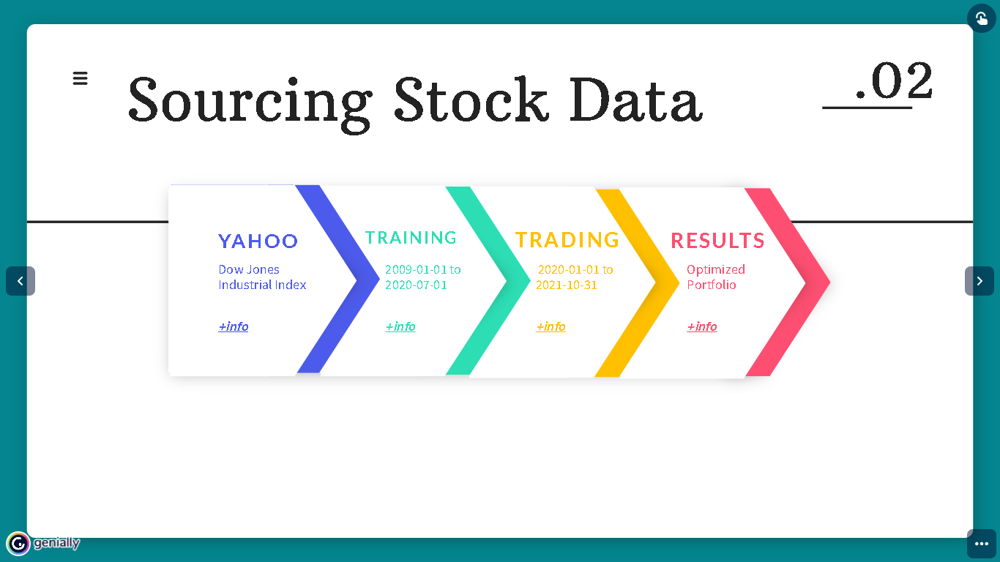
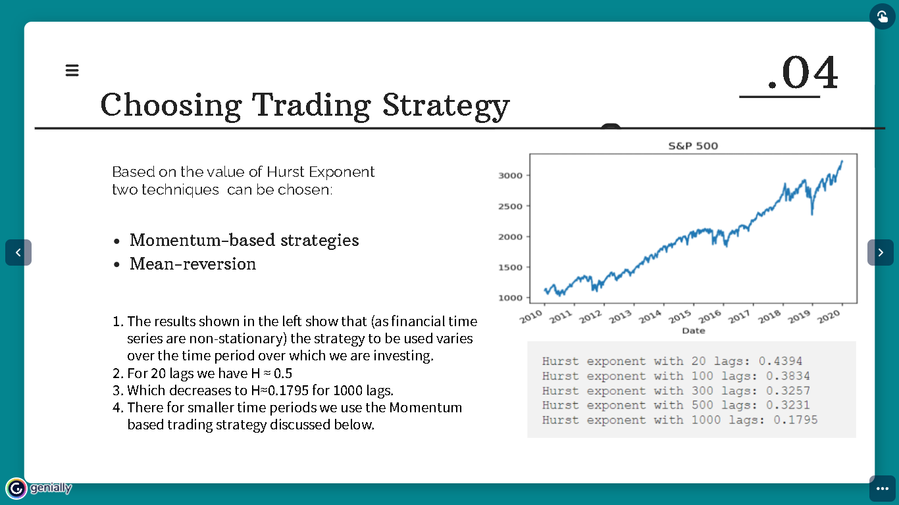
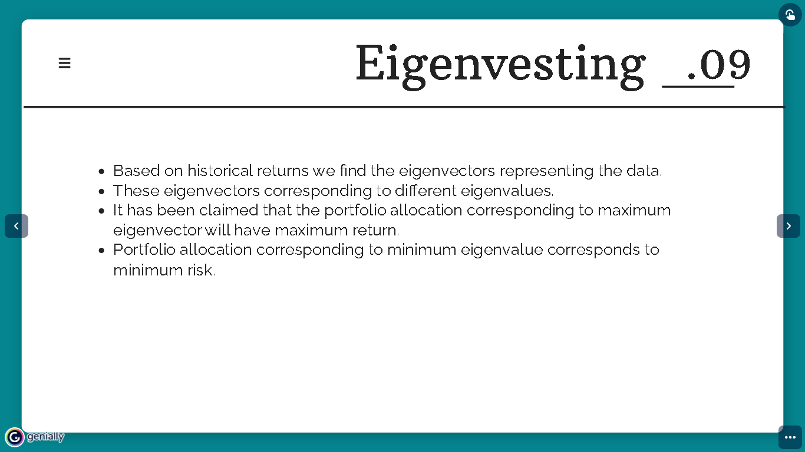
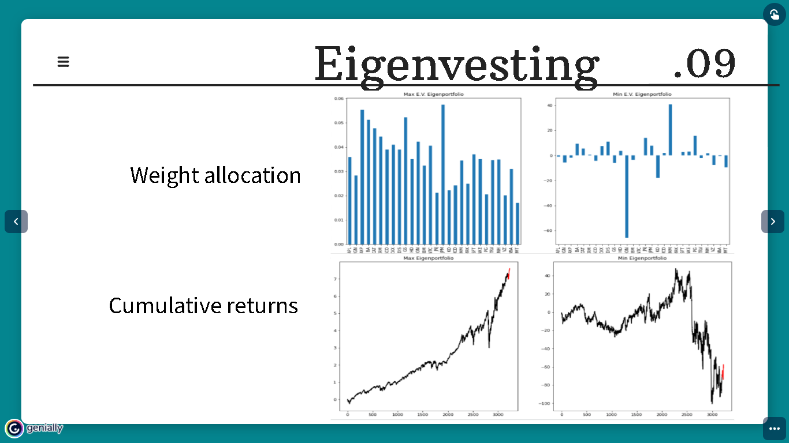
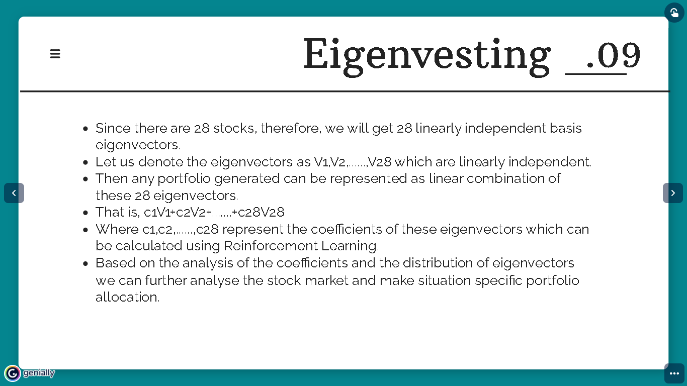
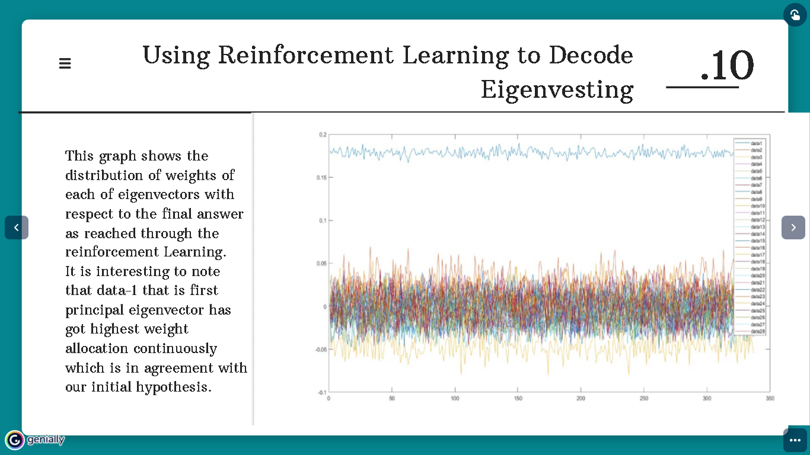
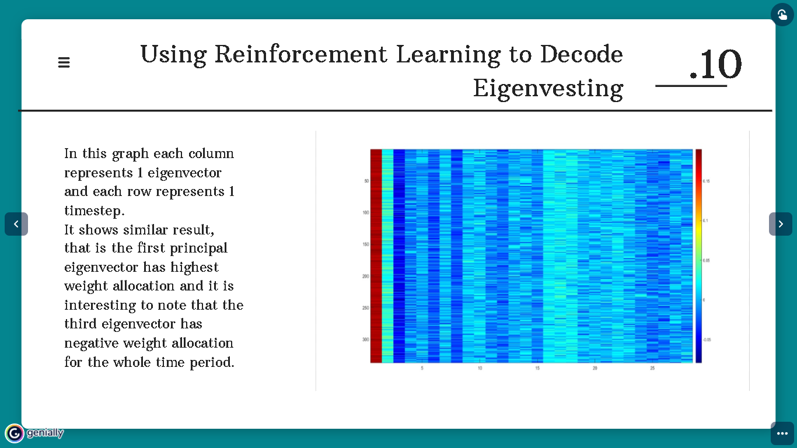
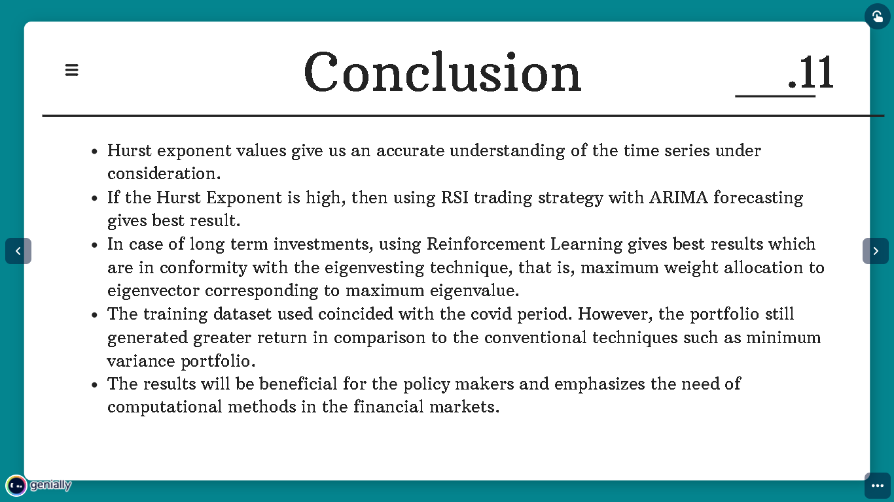

# Portfolio Optimization Using Reinforcement Learning And Eigenvesting Technique

Portfolio optimization is the process of selecting the best portfolio among all portfolios available, so that the returns on that portfolio are maximized and the risk is
minimized in the given holding period. Modern portfolio theory (MPT) given by Harry
Markowitz in 1951 gives us an initial understanding of optimizing portfolios[13]. MPT
emphasizes the trade off between risk and returns to arrive at an efficient portfolio. The
portfolio, constructed using efficient frontier, is well diversified, therefore, is agnostic
to the extreme fluctuation in the market.
Minimum variance portfolio is another well known investing method. It tries to
make a portfolio where the correlation between the constituents of the portfolio is very
low. This method is robust and trustworthy. However, it is not immune to sudden
fluctuations in the market. This strategy is hard and costly to implement since portfolio managers may want to adjust their selections at each time step and consider other
factors such as transaction cost. More precisely we require a methodology which is
self adjusting its strategy according to the changing behaviour of the market. Such
behaviour of the financial market was observed recently during the coronavirus pandemic, therefore, it is important to develop methodologies which are able to steer a
portfolio through such crises by avoiding a blood bath.

## Screenshots

